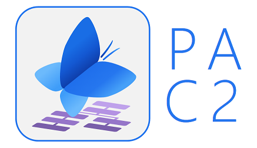
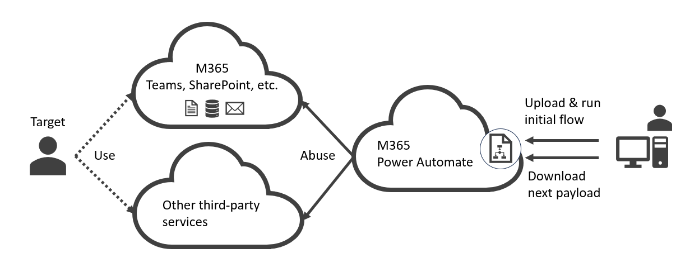
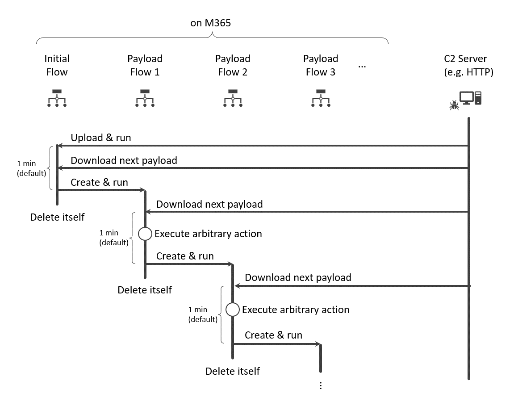
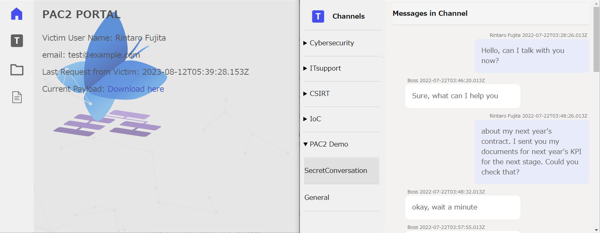

# PAC2: PowerAutomateC2

Power Automate C2 (PAC2) is a stealth living-Off-the-cloud C2 framework. 

## Overview
### Attack Scenario

1. Initial Infection
    - Any impersonation and Session hijack methods
        - e.g., Steal PRT and access to a PowerAutomate page as a victim user
2. Register the Initial Payload
    - Establish C2 connection between PowerAutomate and our C2 server
        - Import a primary payload as a zip file generated by our tool
3. Execute Secondary Payload
    - Attackers generate arbitrary payloads by our tool and put them to the C2 server
    - PowerAutomate downloads the secondary payloads from the C2 server via HTTPS(S)
    - PowerAutomate uploads output executed by the secondary payloads
    - Attackers maintain the secondary payloads in the C2 server anytime, and continue their stealth activities

The main flow between the attacker and PowerAutomate is the following.

### Features
- Living off the cloud (client-free execution)
    - No use of PowerAutomate Desktop Flow
    - No traces in the victim user's endpoint or network devices in the target corporate environments
- **Stealth**
    - **Traces, including the flow itself, are deleted by the payload itself**
- **Persistence**
    - **The C2 connections continues even after victim users change their passwords**
- Bypass security measures
    - Not detected by Anti-Virus and EDR
    - Not blocked by network filtering rules specified in network/proxy solutions
- Flow generation via CUI
    - Attackers can generate PowerAutomate flow by using CUI instead of troublesome low-code GUI
- PAC2 control panel
    - PAC2 control panel provides an easy access to exfiltrated data such as Teams messages and SharePoint files
    
- **Supports bitwise operations in PowerAutomate such as XOR**
    - The operations enables the encryption of payloads and outputs

## Demo

https://github.com/t-tani/pac2-dev/assets/31282248/2380236a-178b-4eca-a7df-fe6f86e14201

